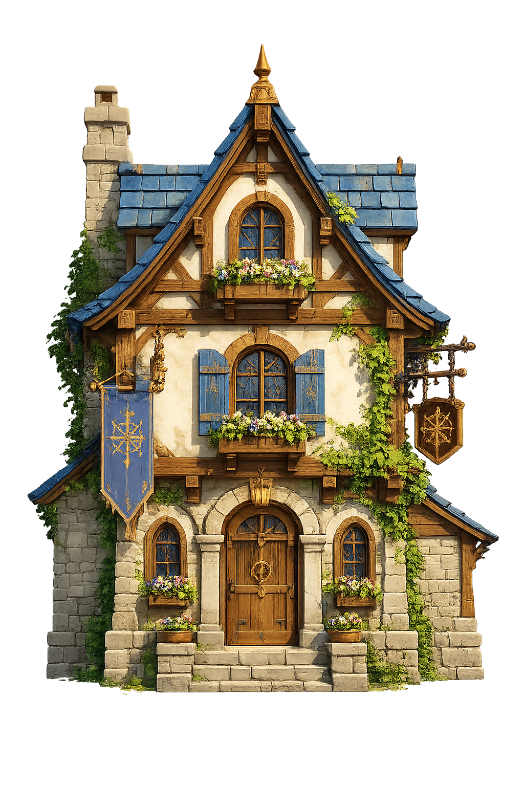

# New House WorldBuilder Implementation Plan

## Binding objective and authoritative reference
Recreate this particular house as closely as possible using the production WorldBuilder, Structures authoring, voxel storage/meshing/rendering, and material/texture systems. Keep rendering, comparing, and correcting until the built-player result is **very close to the reference and production-quality**. Similar style or green CI is not completion.

- Reference: `Assets/Textures/Stylized/experiment1/house/10dddef5-de0a-4153-9c09-b1e8016830db.png`.
- Pinned Git blob: `6d87b08d4c7c9bddc1705c0f34343aa79bc18423`.
- Optional textures: `Assets/Textures/Stylized/experiment1/`. Use, adapt, replace, or create original/generated textures through the normal pipeline with provenance and Unity metadata. Not every supplied texture must be used.

Never substitute Library/search results, generated concepts, or CI screenshots for this reference. Do not modify it to fit the implementation; reconfirm changed reference hashes with the user.

## Current result and next discriminating experiment
Resumed feature `c97d535ab5a1af16155204b43fec80fdf47ba5d9`; reviewed remote master `356b2e0e4d2818901c73bbc6b1788f8d6850356d`. Earlier wrong-Library-image visual approvals remain invalid; reference-dependent tasks stay open.

Direct Git transport has no network access here. The repository connector resolves the pinned PNG/hash but its binary reads return unsupported/empty content. No correct-image visual inspection is claimed. `NewHouseReferenceSourceTests` now verifies the checkout PNG's actual Git blob and preserves its unaltered bytes plus provenance under the existing targeted-CI artifact's `ReferenceInputs/NewHouse/`, explicitly separate from player screenshots. It is a provenance regression, not visual proof, and adds no workflow, renderer, or runtime texture dependency.

Code inspection also found the WorldBuilder test namespace's inert `TestAttribute` shadows the three existing house authoring tests. Restore those tests with fully qualified NUnit attributes and verify actual test-case execution; do not modify the unrelated global quarantine.

Hypothesis A: wrong-reference geometry/material decisions dominate the mismatch. Hypothesis B: camera/framing differences compound it. First retrieve the verified original from CI, inspect its landmarks/proportions, and compare the existing player render; only then choose house corrections.

## Ownership and constraints
`Assets/Game/WorldBuilder` owns reusable/config-driven house assemblies over Structures APIs; site/camera/light remain separate. `Assets/Game/Materials` owns presentation identity; Rendering consumes semantic-free data. Use existing curvature/SDF authoring as appropriate, not a parallel art stack or image billboard. Preserve voxel truth, engine scale, and repository budgets. Evidence export costs one 3.4 MB input copy, outside player/runtime memory.

WorldBuilder `Validation/NewHouseReferenceReconstruction` is primary proof; retain affected-module tests, Rendering `TextureLayers`, and canonical integration. Current validation uses the supported production CPU fallback; this proves nothing about GPU restoration.

## Iteration and remaining gates
Correct silhouette/proportions, roof/openings, details, materials, then lighting/framing. Each cycle records discrepancies, fixes production causes, reruns exact-SHA validation, and compares unaltered target/audit captures with the pinned input. Correct the missed rear-right capture schedule. Isolate repeated failures after two different fixes. Complete every task and very-close visual acceptance before closure, master synchronization, PR + auto-merge, and the required `affected` gate per `SceneIssues/README.md`. No `pending/` or direct master push.
